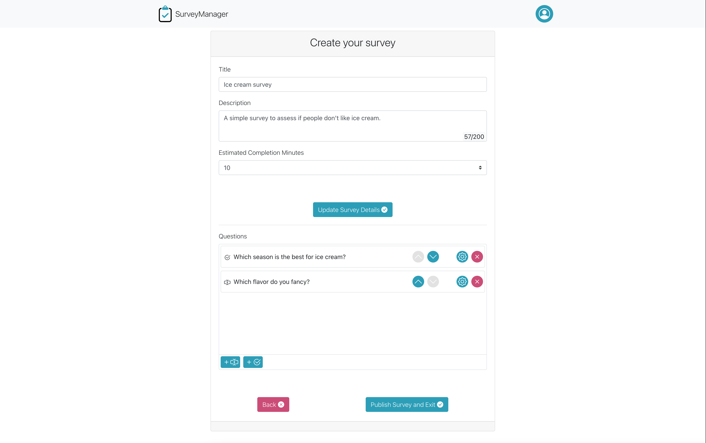

# Exam #1: "Questionario"

## Student: s285913 Bramini Marco

## React Client Application Routes

### Routes:

Discover Module (public)

- `/` or `/discover`: This page is the application landing page. It shows all the available surveys which the user can take.

User Identification Module (public)

- `/user-id`: This page allows the application to collect the user information necessary to start the survey.

Survey Module (public)

- `/surveys/:surveyID`: This page contains the summary of a survey. This is the entrypoint of the user's journey that ends with the submission of a survey.

- `/surveys/:surveyID/questions/:questionPosition`: This page allows the user to answer to a question. This route is only accessible when an attempt to fill a survey is in progress. In case of refresh the user is warned that he's going to lose all his answers.

- `/surveys/:surveyID/submit/`: This page allows the user to submit his attempt to fill a survey.

Admin Login Module (public)

- `/admin-login`: This is the login page for admins.

Survey Manager Module (admin protected)

- `/manager`: This page shows the information about the surveys owned by an admin. Also, it allows the admin to manage his surveys.

- `/manager/surveys/create/:surveyID`: (:surveyID parameter is optional) This page allows the admin to create, update and publish a new survey.

- `/manager/surveys/:surveyID/report`: This page contains all the information about the user attemps associated to a survey.

## API Server

### CreateSurvey

Creates a new survey.

**Method**: `POST` `/survey-manager/apis/admin/surveys`

**Permissions**: ADMIN

**Request Body Example**

    {
      "title":"Ice cream survey",
      "description":"A simple survey to assess if people like ice cream.",
      "isPublished":true,
      "estCompletionMinutes":7
    }

**Response Example**

    {
      newSurveyID: 1
    }

---

### GetAvailableSurveys

Returns all the available surveys for the users.

**Method**: `GET` `/survey-manager/apis/surveys`

**Permissions**: USER

**Query Parameters Example**

- `search`: Filters the request output only to surveys which contains this value in the title and/or description.
- `limit`: Limits the request output to the specified amount of surveys.
- `order`: Sorts the request output. Available values are: `[+submitsCount -submitsCount, +createdAt, -createdAt, +publishedAt, -publishedAt, +title, -title]`;

**Response Example**

    [
      {
        "id": 1,
        "title": "Ice cream survey",
        "description": "A simple survey to assess if people like ice cream.",
        "createdAt": "2021-06-19T06:57:41.145Z",
        "isPublished": 1,
        "publishedAt": "2021-06-19T09:57:41.145Z",
        "estCompletionMinutes": 15,
        "questions": [
          {
            "id": 1,
            "surveyID": 1,
            "position": 1,
            "title": "What flavor do you fancy?",
            "type": "OPEN",
            "isOptional": 1,
            "maxAnswerLength": 200,
            "minChoices": null,
            "maxChoices": null,
            "options": null
          }, ...
        ]
      }, ...
    ]

---

### GetSurvey

Returns the survey associated to the passed ID.

**Method**: `GET` `/survey-manager/apis/surveys/:surveyID`

**Permissions**: USER

**Response Example**

    {
      "id": 1,
      "title": "Ice cream survey",
      "description": "A simple survey to assess if people like ice cream.",
      "createdAt": "2021-06-19T06:57:41.145Z",
      "isPublished": 1,
      "publishedAt": "2021-06-19T09:57:41.145Z",
      "estCompletionMinutes": 15,
      "questions": [
        {
          "id": 1,
          "surveyID": 1,
          "position": 1,
          "title": "What flavor do you fancy?",
          "type": "OPEN",
          "isOptional": 1,
          "maxAnswerLength": 200,
          "minChoices": null,
          "maxChoices": null,
          "options": null
        }, ...
      ]
    }

---

### GetOwnedSurveys

Returns all the surveys owned by the admin who issued the request.

**Method**: `GET` `/survey-manager/apis/admin/surveys`

**Permissions**: ADMIN

**Query Parameters Example**

- `limit`: Limits the request output to the specified amount of surveys.
- `order`: Sorts the request output. Available values are: `[+submitsCount -submitsCount, +createdAt, -createdAt, +publishedAt, -publishedAt, +title, -title]`;

**Response Example**

    [
      {
        "id": 1,
        "title": "Ice cream survey",
        "description": "A simple survey to assess if people like ice cream.",
        "createdAt": "2021-06-19T06:57:41.145Z",
        "isPublished": 1,
        "publishedAt": "2021-06-19T09:57:41.145Z",
        "estCompletionMinutes": 15,
        "questions": [
          {
            "id": 1,
            "surveyID": 1,
            "position": 1,
            "title": "What flavor do you fancy?",
            "type": "OPEN",
            "isOptional": 1,
            "maxAnswerLength": 200,
            "minChoices": null,
            "maxChoices": null,
            "options": null
          }, ...
        ]
      }, ...
    ]

---

### GetOwnedSurvey

Returns the survey associated to the passed ID, owned by the admin who issued the request.

**Method**: `GET` `/survey-manager/apis/admin/surveys/:surveyID`

**Permissions**: ADMIN

**Response Example**

    {
      "id": 1,
      "title": "Ice cream survey",
      "description": "A simple survey to assess if people like ice cream.",
      "createdAt": "2021-06-19T06:57:41.145Z",
      "isPublished": 1,
      "publishedAt": "2021-06-19T09:57:41.145Z",
      "estCompletionMinutes": 15,
      "questions": [
        {
          "id": 1,
          "surveyID": 1,
          "position": 1,
          "title": "What flavor do you fancy?",
          "type": "OPEN",
          "isOptional": 1,
          "maxAnswerLength": 200,
          "minChoices": null,
          "maxChoices": null,
          "options": null
        }, ...
      ]
    }

---

### UpdateSurvey

Updates the survey associated to the passed ID.

**Method**: `PUT` `/survey-manager/apis/admin/surveys/:surveyID`

**Permissions**: ADMIN

**Request Body Example**

    {
      "title": "Ice cream survey",
      "description": "A simple survey to assess if people don't like ice cream.",
      "createdAt": "2021-06-18T22:13:41.962Z",
      "isPublished": 1,
      "publishedAt": null,
      "estCompletionMinutes": 7,
      "submitsCount": 0,
      "userID": 1
    }

**Response Example**

    {
      updatedSurveyID: 1
    }

---

### DeleteSurvey

Deletes the survey associated to the passed ID.

**Method**: `DELETE` `/survey-manager/apis/admin/surveys/:surveyID`

**Permissions**: ADMIN

---

### CreateQuestion

Creates a new question for the survey associated to the passed ID.

**Method**: `POST` `/survey-manager/apis/admin/surveys/:surveyID/questions`

**Permissions**: ADMIN

**Request Body Examples**

    {
      "position": 1,
      "title":"Do you like ice cream?",
      "type":"OPEN",
      "isOptional":false,
      "maxAnswerLength":200
    }

    {
        "position":1,
        "title":"What flavor do you fancy?",
        "type":"MULTIPLE_CHOICE",
        "minChoices":0,
        "maxChoices":1,
        "options": ["Strawberry", "Blackberry"]
    }

**Response Example**

    {
      newQuestionID: 1
    }

---

### UpdateQuestion

Updates the question associated to the passed ID.

**Method**: `PUT` `/survey-manager/apis/admin/surveys/:surveyID/questions/:questionID`

**Permissions**: ADMIN

**Request Body Example**

    {
      "position": 1,
      "title":"Do you like ice cream?",
      "type":"OPEN",
      "isOptional":false,
      "maxAnswerLength":200
    }

    {
        "position":1,
        "title":"What flavor do you fancy?",
        "type":"MULTIPLE_CHOICE",
        "minChoices":0,
        "maxChoices":1,
        "options": ["Strawberry", "Blackberry"]
    }

**Response Example**

    {
      updatedQuestionID: 1
    }

---

### PositionDownQuestion

Moves the question associated to the passed ID down by one position.

**Method**: `POST` `/survey-manager/apis/admin/surveys/:surveyID/questions/:questionID/`positionDown`

**Permissions**: ADMIN

**Response Example**

    {
      updatedQuestionID: 1
    }

---

### PositionUpQuestion

Moves the question associated to the passed ID up by one position.

**Method**: `POST` `/survey-manager/apis/admin/surveys/:surveyID/questions/:questionID/`positionUp`

**Permissions**: ADMIN

**Response Example**

    {
      updatedQuestionID: 1
    }

---

### DeleteQuestion

Deletes the question associated to the passed ID.

**Method**: `DELETE` `/survey-manager/apis/admin/surveys/:surveyID/questions/:questionID`

**Permissions**: ADMIN

---

### GetOwnedSurveysAttemps

Returns all the attempts submitted for the survey associated to the passed ID.

**Method**: `GET` `/survey-manager/apis/admin/surveys/:surveyID/attempts`

**Permissions**: ADMIN

**Query Parameters Example**

- `search`: Filters the request output only to the attempts submitted by users with a name that contains this value.
- `limit`: Limits the request output to the specified amount of survey attempts.
- `order`: Sorts the request output. Available values are: `[+submittedAt, -submittedAt]`;

**Response Example**

    [
      {
        "id": 1,
        "surveyID": 1,
        "userFullName": "Mario Biondi",
        "startedAt": "2021-06-20T12:00:00.000Z",
        "submittedAt": "2021-06-20T22:17:43.842Z",
        "answers": [
          {
            "surveyAttemptID": 1,
            "questionID": 1,
            "value": null
          }, ...
        ]
      }, ...
    ]

---

### SubmitSurveyAttempt

Submits a new attempt for the survey associated to the passed ID.

**Method**: `POST` `/survey-manager/apis/surveys/:surveyID/attempts`

**Permissions**: USER

**Request Body Examples**

    {
      "userFullName":"Mario Biondi",
      "startedAt":"2021-06-20T12:00:00.000Z",
      "answers":[{
          "questionID": 1,
          "value": null
      },{
          "questionID": 2,
          "value": ["Si"]
      },{
          "questionID": 3,
          "value": "si"
      }, ...
      ]
    }

**Response Example**

    {
      newSurveyAttemptID: 1
    }

## Database Tables

- `users` - (id, email, hash, name, role) - Contains the data about users.
- `surveys` - (id, title, description, createdAt, isPublished, publishedAt, estCompletionMinutes, submitsCount, userID) - Contains the data about surveys.
- `questions` - (id, surveyID, position, title, type, isOptional, maxAnswerLength, minChoices, maxChoices, options) - Contains the data about questions.
- `survey_attempts` - (id, surveyID, userFullName, startedAt, submittedAt) - Contains the data about survey attempts.
- `answers` - (surveyAttemptID,questionID, value) - Contains the data about attempts answers.

## Main React Components

### Pages (container components):

- `SurveyDiscoverPage`: The page shows a grid of surveys, available for the user. Surveys can be ordered by publication time, number of submits or title. The users can also search for a specific survey.
- `UserIdentificationPage`: This page allows to collect user data before starting a survey submission attempt. After the first identification data are persisted and the user can choose to use the last name or insert another.
- `SurveyPage`: This page contains a summary of a survey. The user can start a new attempt or recover the last one (only if his name matches and the survey is the same).
- `SurveyQuestionPage`: This page allows the user to answer to a question. It is accessible only if an attempt is in progress. The page contains an browsable question index and navigation buttons. If the user tries to refresh in this page, he is asked for confirmation.
- `SurveySubmitPage`: This page contains a summary of the user attempt. He can submit his attempt or go back to the questions.
- `AdminLoginPage`: The page where admins can login to the management area.
- `SurveyManagerPage`: This page contains the data about all the surveys owned by an admin. There are two sections: unpublished surveys section, where the admin can manage surveys not yet published, and owned surveys section, where the admin can view the results of his surveys.
- `CreateSurveyPage`: This page allows the admin to create, update or publish a survey. For new surveys, questions form is disabled until the survey is created.
- `SurveyReportPage`: This page allows the admin to view a survey results. He can search between user's attempts and navigate between them.

### UI Components (presentation components):

- `CreateSurveyForm` (in `src/ui-components/CreateSurveyForm`): A form to collect data for a new survey or to edit an already existing one. Used in `CreateSurveyPage`.

- `CreateQuestionForm` (in `src/ui-components/CreateQuestionForm`): A form to collect data for a new question or to edit an already existing one. This component behave differently based on the passed question type (OPEN or MULTIPLE_CHOICE). Used in `CreateSurveyPage`.

- `SurveyQuestionEditor` (in `src/ui-components/CreateQuestionForm`): A widget used to show the questions associated to a survey. It provides actions to change question position, create, update or delete them. Used in `CreateSurveyPage`.

- `MultipleChoiceOptionsFormField` (in `src/ui-components/CreateQuestionForm`): A widget used to manage a multiple choice question's options. Used in `CreateSurveyPage`.

- `SurveyAttemptDetailsModal` (in `src/ui-components/SurveyAttemptDetailsModal`): A modal widget used to visualize a survey submitted attempt. It contains the attempt informations and the list of answers the user provided. Used in `SurveyReportPage`.

- `SurveyAttemptList` (in `src/ui-components/SurveyAttemptList`): A widget containing the list of survey attempts. List entries can be clicked. Used in `SurveyReportPage`.

- `SurveyCardGrid` (in `src/ui-components/SurveyCardGrid`): A responsive cards grid. It takes the cards to show as children. The cards type must be in the following list [`SurveySummaryCard`, `UnpublishedSurveyCard`, `CreateSurveyCard`]. Used in `SurveyDiscoverPage` and `SurveyManagerPage`.

- `SurveyDetailsCard` (in `src/ui-components/SurveyDetailsCard`): A component used to visualize the details of a survey. It takes as children action components which will be rendered within its body. Used in `SurveyPage` and `SurveyReportPage`.

- `SurveyQuestionCard` (in `src/ui-components/SurveyQuestionCard`): A component used to visualize the details of a survey's question and to submit or update an answer during a survey submission attempt. It takes as children components with types in this list: [`SurveyOpenQuestionForm`, `SurveyMultipleChoiceQuestionForm`].
  It also provides support for questions navigation. Used in `SurveyQuestionPage`.

- `SurveyMultipleChoiceQuestionForm` (in `src/ui-components/SurveyMultipleChoiceQuestionForm`): A form used to collect user input for a multiple choice survey's question. Used in `SurveyQuestionPage`.

- `SurveyOpenQuestionForm` (in `src/ui-components/SurveyOpenQuestionForm`): A form used to collect user input for an open survey's question. Used in `SurveyQuestionPage`.

- `SurveyAttemptDetailsCard` (in `src/ui-components/SurveyAttemptDetailsCard`): A component used to visualize the details of a survey attempt. It takes as children action components which will be rendered within its body. Used in `SurveySubmitPage`.

## Screenshot

## Admin Credentials

- **Username**: mario.rossi@admin.com **Password**: admintest

  Owns the surveys: ["Do you have any pet?", "Do you like ice cream?"]

- **Username**: carlo.blu@admin.com **Password**: testadmin

  Owns the surveys: ["What car do you like?", "What is your job?", "Are you satisfied with Google?", "What sport do you prefer?"]
